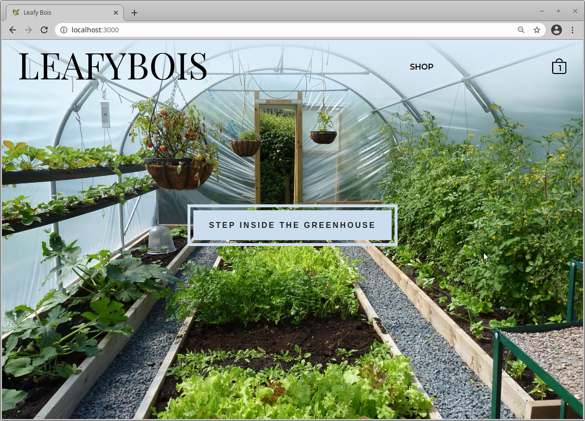
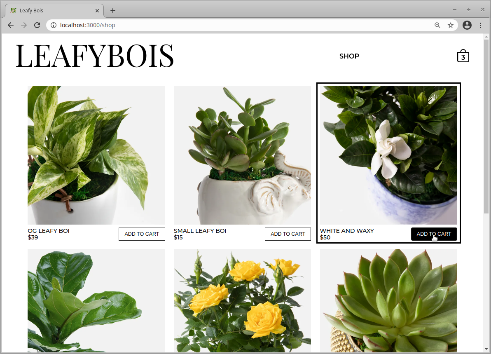
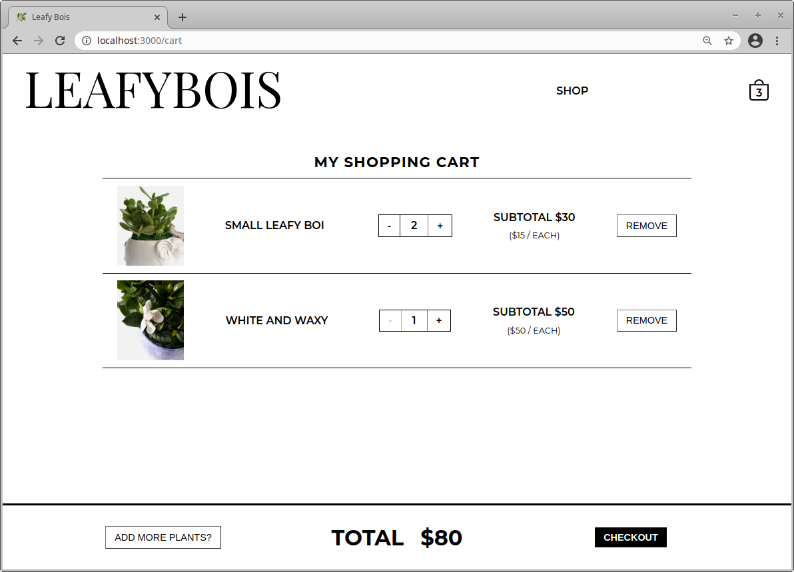
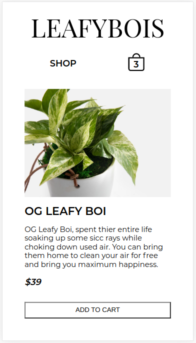

# Shopping Cart Webpage
A small, scaleable e-commerce site with a shopping cart created in React. Items are tracked and added to cart where the quantity can be changed. Real time subtotals and cart totals.

Look and feel inspired by [Zara.com](https://www.zara.com)

[See Here](https://jmilll.github.io/shopping-cart/)

## Example
### Home

### Shop

### Cart

### Item Page - Mobile

[See Here](https://jmilll.github.io/shopping-cart/)

## Features

* React
* Web Shop
* Cart
* Unit tracking
* Cost tracking - per item and total cart

## Motivation

The purpose of this project was to use React hooks and lifecycle methods with functional components to create a website with a shopping cart.

## Technologies Used

* React
* JavaScript
* HTML / CSS

## Acknowledgements

This project was inspired by [The Odin Project Shopping Cart](https://www.theodinproject.com/courses/javascript/lessons/shopping-cart) online learning curriculum.

## License

Images pulled from [Urbanstems.com](https://www.urbanstems.com)

MIT